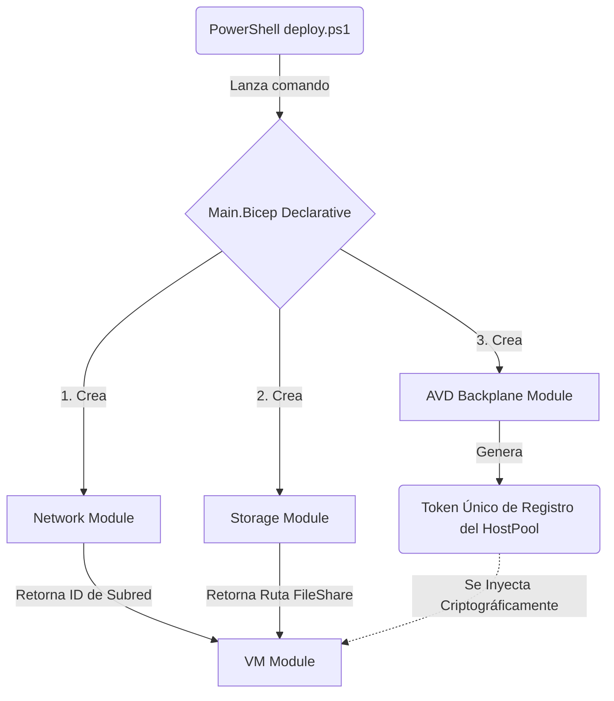
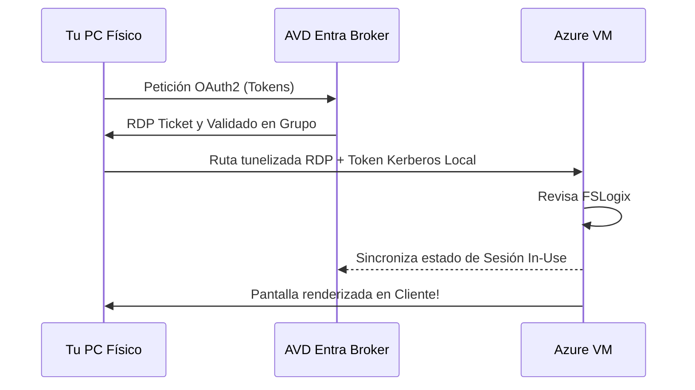

# Flujo de Despliegue de Azure Virtual Desktop (AVD)

Este documento detalla a bajo nivel la orquestación técnica, el flujo de ejecución dependiente y la arquitectura subyacente que opera al lanzar nuestro código **Zero-Touch Bicep** hacia la nube de Azure. Puedes exportarlo, guardarlo o copiarlo a un documento **Word (.docx)** como tu manual oficial de infraestructura.

## Fase 1: Inicialización y Autenticación del Script Base
El flujo se gatilla con la ejecución de `deploy.ps1`.
1. **Credenciales en RAM:** Recolecta la tupla administrativa (`$AdminPassword`) y prepara parámetros globales (Grupo de Recursos, Id de Grupo, Tokens).
2. **Auto-Login:** Si Azure CLI no detecta una huella de sesión nativa, interviene lanzando `az login` interactivo sobre el navegador.
3. **Mapeo de Roles (RBAC):** Encuentra, resuelve y extrae tu Identificador Central de Grupos (`avdGroupId` por default), lo que nos ahorrará dolores de cabeza más adelante unificando el control central de todos nuestros accesos a través de roles definidos hacia dicho grupo.

## Fase 2: Orquestador Principal Bicep (`main.bicep`)
Acto seguido, la infraestructura empuja el molde `main.bicep`, disparando en paralelo Módulos atómicos, limitados por sus dependencias estrictas.

## Fase 3: Aprovisionamiento de la Capa "Backplane" y Redes
1. `modules/network.bicep`: Inyecta la red primaria de lab (`vnet-avd-lab-01`) estableciendo prefijos estáticos seguros de Subredes para alojar hosts o endpoints cerrados.
2. `modules/avd-backplane.bicep`: Genera el alma de tu espacio nativo.
    * Crea el **Workspace** que ven los usuarios.
    * Dota de vida al **Application Group** enganchándolo al Workspace.
    * Establece el **Host Pool**, aplicándole las políticas directas RDP sin pasarela clásica (`enablerdsaadauth:i:1; targetisaadjoined:i:1`).
3. `modules/storage.bicep`: Prepara un **Storage Account de FileServices** (`fslogix-profiles`). Le otorga *Azure Files Entra ID Kerberos Auth* al volumen (`ActiveDirectoryProperties`) para posibilitar escritura directa con identidad moderna a FSLogix sin el requerimiento on-premises.

## Fase 4: La Máquina Virtual y Capa "Zero-Touch" (`vm.bicep` e `install-agent.ps1`)
El paso crítico técnico ocurre aquí, encadenando extensiones operativas de Azure al invitado Windows.
1. Se crea la Computadora B2s y se inyecta la Identidad Administrada de Plataforma (`SystemAssigned`).
2. Se lanza la Extensión `AADLoginForWindows`, la cual liga el componente nativo de acceso AAD Kerberos mediante comandos de registro unificando a Windows con Entra ID en la nube.
3. **El Inyector Minificado (Custom Script Extension):**
    * Envuelve el archivo minificado `install-agent.ps1` en *Base64* (saltando la limitación de CLI nativo).
    * `install-agent.ps1` hace limpieza de registros huérfanos anteriores para evitar bloqueos del instalador de Windows (`msiexec`).
    * El script en RAM baja directamente los binarios oficiales del agente AVD y arranca una instalación paramétrica adjuntando silenciosamente tu `{Token}` generado en el Paso 2 en las propiedades del instalador base.
4.  **Activación de FSLogix:** Configura el Registro `HKLM` permitiendo rutinas `CloudKerberosTicketRetrievalEnabled`, apuntando el volumen `fslogix-profiles` de red (Azure Files) como contenedor único.

## Fase 5: Conexión Cliente Externa (Endpoint User)
Con todo el túnel verde y sano:
1. El Agente físico hace latidos por los puertos `tcp/443` HTTPS hacia el Plano de Control de Azure. Este lo inscribe en vivo como Host Disponible (`Available`).
2. Muestra tu recurso bajo la interfaz de Office/Windows App en cualquier equipo global.

